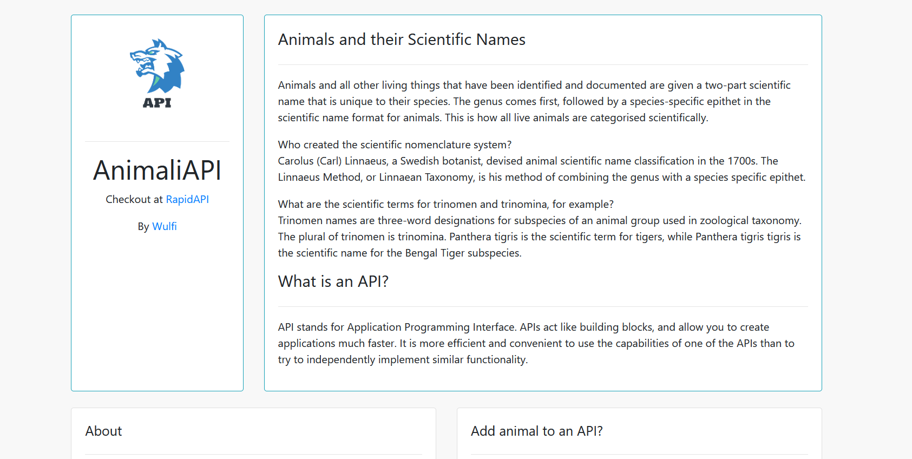
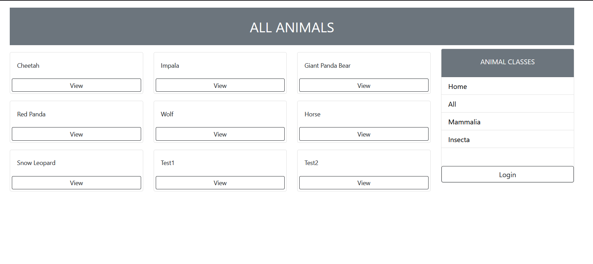
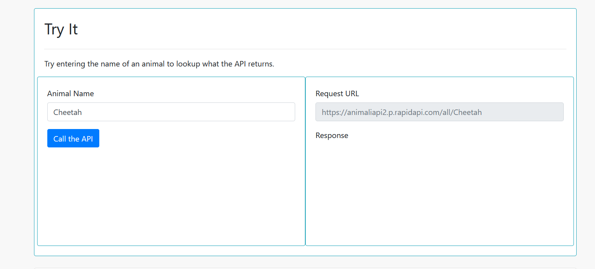
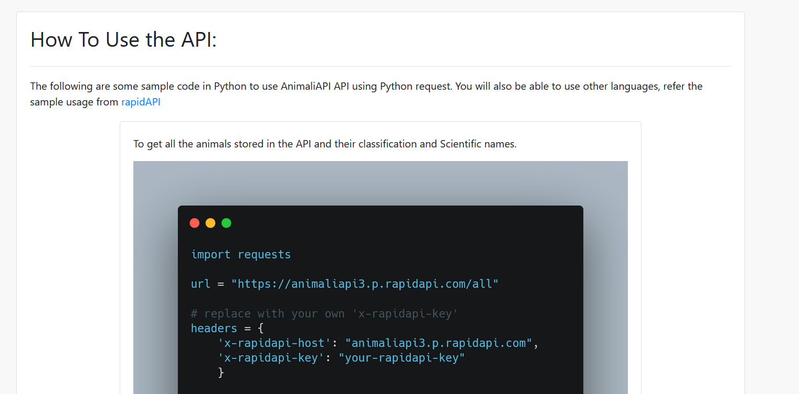

# AnimaliAPI

# Installation
* 1 - git clone https://github.com/Ugyenwangdi/AnimaliAPI.git
* 2 - create a virtual environment and activate
*  - pip install virtualenv
*  - virtualenv envname
*  - envname\scripts\activate
* 3 - cd into project "cd AnimaliAPI"
* 4 - pip install -r requirements.txt
* 5 - python manage.py runserver

# Features
* Get scientific name and details of an animal 
* Filter animals by categories

# Tech Stack
* Django
* Django REST Framework

# Home Page
  

# All animals Page
  

# Try API
  

# How to use 
  

